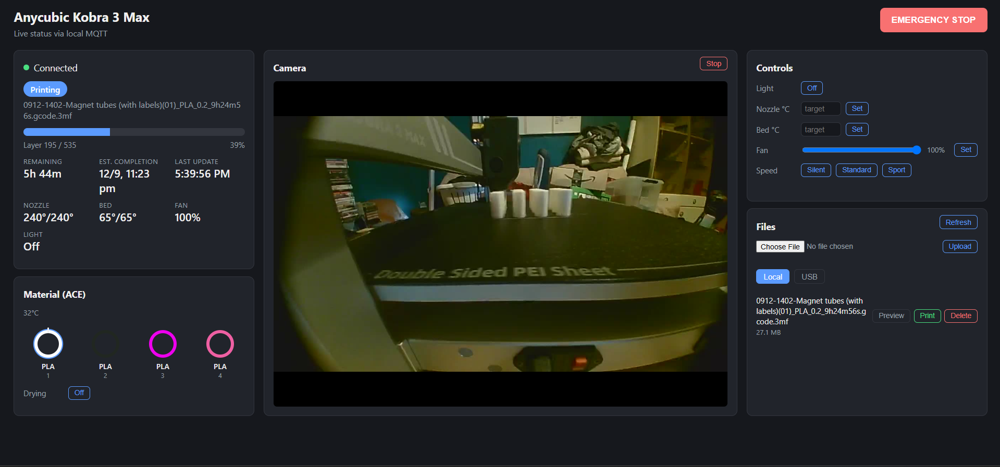

# Kobra LAN Monitor

A self-hosted web dashboard for the Anycubic Kobra 3 (and likely other Kobra 3-generation printers), built by fully reverse-engineering Anycubic's local LAN protocol — no cloud account, no Anycubic app, no third-party relay. It talks directly to your printer over your own network.

Part of a small family of tools built out of real Kobra 3 Max ownership — see [Kobra 3 Max: The Long Way Round](https://github.com/A-to-PC/Kobra-3-Max-Journey) for the full story of why this exists.

Live status, camera streaming, print control, ACE (multi-material) filament and drying control, and remote file/print management, all from a browser on any device on your LAN.



## Features

**Every feature is now live-verified against a real printer — nothing left untested:**
- Live status: state, progress, layer, ETA, nozzle/bed temps, fan, filament slots
- Genuine continuous camera stream (MJPEG, low latency — no polling), with its own Start/Stop control — fully independent of Slicer Next
- Pause / Resume / Emergency Stop
- File browser (local storage + USB): list, folder navigation, delete, preview thumbnails, upload from your PC, and start a print from any file
- ACE box: filament colours/types, active-slot indicator, drying on/off
- Controls card — light on/off, nozzle/bed temperature, fan speed, print-speed-mode adjustment mid-print (each confirmed live: a commanded value shows up as the real target temp/speed on the printer itself, not just in the UI). Light brightness isn't included — confirmed via Slicer Next's own UI that this light hardware isn't dimmable, on/off is all it supports.
- Auto/Light/Dark theme, shared across both tabs — follows your OS by default, or pick one explicitly via the toggle in the nav bar
- Multiple printers — add, rename, and switch between as many Anycubic printers as you own from the nav bar. Only one is ever actively connected/monitored at a time; switching is a deliberate reconnect, not several MQTT sessions running at once

## Advanced tab

A second tab (next to Home) for secondary/occasional-use features the main dashboard deliberately stays clear of: firmware update checking, disabling steppers, querying toolhead position, ACE Pro filament feed/unwind, and browsing/exporting time-lapse videos. Every command on this page was found as a real, literal string inside the printer's own firmware, but not all of them have been confirmed against real hardware yet — each feature is labelled with its actual confidence level (wire-confirmed / live-verified / guess) rather than presenting everything as equally trustworthy.

Firmware updates are two genuinely different checks, kept side by side:
- **K3M version check** — live-verified, works with no cloud account at all. Compares your printer's own reported version against a public, checksummed firmware mirror ([jbatonnet/Rinkhals.Firmwares](https://github.com/jbatonnet/Rinkhals.Firmwares)) and links straight to the matching download plus a USB-install how-to.
- **Cloud OTA status** — passive-only by design, and the one place in this app that still depends on the printer's own cloud connection (off in LAN mode, this app's whole reason to exist). There's no command that can force a check; it only shows whatever the printer's own cloud connection last reported in passing — currently the sole source for the ACE Pro's own firmware version, since that isn't in any LAN report.

If a date shows up blank next to a file, that's deliberate — the printer sometimes reports a bogus tiny counter instead of a real timestamp for files tied to a print task, and the UI hides it rather than show something wrong.

## Installation (Windows)

Grab the installer from the [latest release](https://github.com/A-to-PC/kobra-lan-monitor/releases/latest) — a self-contained one-click `.exe`, bundled ffmpeg included, no .NET SDK required. It adds a Windows Firewall exception automatically (needs one UAC prompt for that) and creates three Start Menu/Desktop shortcuts: **Start**, **Stop**, and **Open** (reopens the dashboard in your browser without restarting anything). First run walks you through the one-time setup form described in step 5 below.

Prefer to build from source instead (or need it on another OS)? See **Setup (build from source)** below.

## Why this exists

Anycubic's own apps (Slicer Next, the Anycubic Cloud app) require a cloud account and don't expose everything the printer's own LAN protocol actually supports. This project talks to the printer the same way those official apps do — a local HTTP handshake to discover per-session MQTT credentials, then mutual-TLS MQTT directly to the printer — just without the cloud account requirement.

Credentials are never hardcoded. Every session performs its own live handshake against your printer's IP to obtain fresh, printer-specific credentials. Nothing here embeds Anycubic's shared fleet secrets.

## Requirements

Using the installer above? Only the last two items apply — it bundles its own runtime and ffmpeg. Building from source needs all four:

- .NET 10 SDK
- `ffmpeg.exe` (Windows build) placed in the project root — not bundled in this repo (keeps the repo small; this is a third-party binary). Grab a static Windows build from [gyan.dev](https://www.gyan.dev/ffmpeg/builds/) and drop `ffmpeg.exe` next to `KobraLanMonitor.csproj`.
- Your printer must be on the same LAN, with LAN mode reachable (this is the same connection Slicer Next itself uses).
- A camera — a generic USB webcam works fine on stock firmware, no hacking required, despite what Anycubic's documentation implies about needing their own module.
  - Confirmed working cleanly: **Microsoft LifeCam HD-3000** (720p).
  - Confirmed detected and streaming, but with a "doubled frame" artifact (part of the image is a stale previous frame): **Razer Kiyo** (defaults to 1080p). Reproduced identically in Anycubic's own Slicer Next, so it's the printer's own onboard video pipeline, not something this app or its client can fix.
  - Working theory (two data points, not proven): Anycubic's own official camera accessory is 720p, matching the HD-3000 that works cleanly — the printer's video pipeline may simply be tuned for that resolution and mishandle higher ones like the Kiyo's default 1080p. **A 720p USB webcam is the safer bet** until this gets more data points.

## Setup (build from source)

**1. Get the code onto a permanent location** — this isn't something to run from a Downloads or temp folder, since it's meant to keep running long-term in the background.

- With git: `git clone https://github.com/A-to-PC/kobra-lan-monitor.git C:\Apps\KobraLanMonitor`
- Without git: on this page, click **Code → Download ZIP**, then extract it to a permanent folder, e.g. `C:\Apps\KobraLanMonitor`

**2. Add ffmpeg.** Download a static Windows build from [gyan.dev](https://www.gyan.dev/ffmpeg/builds/) (the "release essentials" zip is fine), and copy `ffmpeg.exe` out of its `bin` folder into the project folder from step 1 — the same folder that has `KobraLanMonitor.csproj` in it.

**3. Build a runnable copy.** From that same folder:

```
dotnet publish -c Release -o publish
```

This creates a `publish` subfolder — that's the actual app. You can ignore the source files after this; `publish` is what you'll run and leave in place.

**4. Run it:**

```
cd publish
dotnet KobraLanMonitor.dll
```

Leave that window open (or run it via Task Scheduler / a Windows service if you want it to survive reboots — not covered here yet). Add `--HttpPort=XXXX` if you want something other than the default `8899`.

**5. Open `http://localhost:8899`** (or `http://<your-pc-ip>:8899` from another device on the same network), and complete the one-time setup form: your printer's LAN IP address, and a username/password for the dashboard itself (this is separate from anything Anycubic-related — it's just to keep your own dashboard private on your network). This only sets up your first printer — if you own more than one, add and switch between them any time via the nav bar.

Settings are stored under `%LOCALAPPDATA%\KobraLanMonitor\settings.json` — outside the project/publish folder entirely, so rebuilding with `dotnet publish` (even into the same `publish` folder) never touches them.

**Running a second, isolated instance** (e.g. to test against a different/emulated printer without touching your real one's config): set the `KOBRA_LAN_MONITOR_DATA_DIR` environment variable before launching that instance to point it at its own settings folder instead of the shared default, and give it a different `--HttpPort`. Two instances never share state unless you point them at the same folder on purpose.

## Known limitations

- Currently Windows-only, due to the bundled `ffmpeg.exe` dependency for the camera stream. A Linux build would need its own ffmpeg binary and a small path change in `CameraStreamHandler.cs`.
- This reverse-engineers an undocumented protocol. Anycubic firmware updates could change or break it at any time without warning.
- Only tested against a Kobra 3 Max. Other Kobra 3-generation printers (K3, KS1, KS1 Max) use the same protocol family per the documented model IDs, but haven't been personally verified.
- No raw G-code injection (homing, arbitrary M/G-codes) — Anycubic's stock LAN protocol simply doesn't expose that. It only exists via Rinkhals' Moonraker bridge on custom firmware.

## How this got built

I've spent decades working in IT, and yes, I do use AI (Claude) heavily to write the code in this project — whole features that would've taken weeks or months by hand come together in minutes to hours instead. No apology for that. What's mine is the experience behind every decision: what was actually worth building, telling a real fix apart from one that just sounds plausible, and the judgment to verify every claim against the real printer before it shipped, not take it on faith from a chatbot. The typing speed was never the hard part.

## Credit / prior art

The protocol groundwork here was independently reverse-engineered, then cross-checked against and refined using:
- [rvanderp3/kobra-connect](https://github.com/rvanderp3/kobra-connect) — the most complete public MQTT command reference found
- [SlimQuiggle/KobraCache](https://github.com/SlimQuiggle/KobraCache) — confirmed the file list/delete command shape independently, working live against a Kobra S1

## License

MIT — see [LICENSE](LICENSE).
